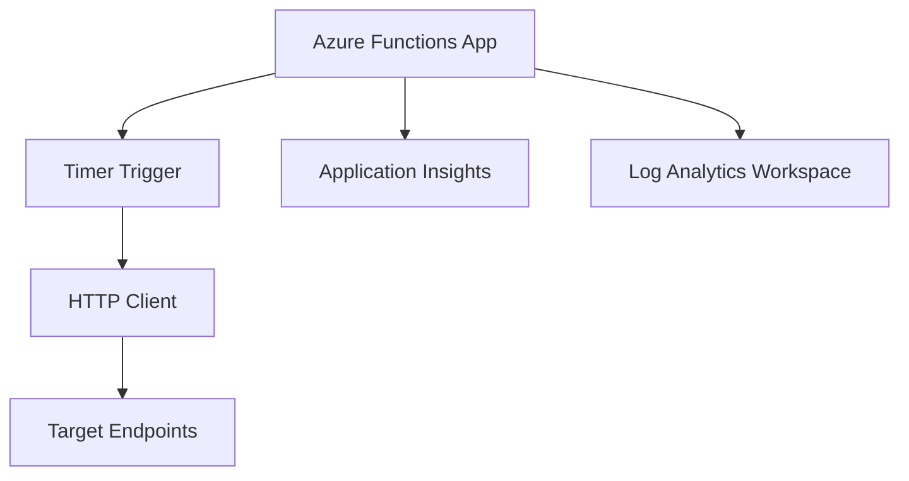

# Azure Deployment Plan for FakeAlwaysOn Project

## **Goal**
Deploy an Azure Functions app that pings configurable endpoints to simulate an "Always On" feature for free tier App Services.

## **Project Information**
- **AppName**: FakeAlwaysOn
- **Technology Stack**: Azure Functions (Node.js or .NET Core)
- **Application Type**: Serverless function that periodically pings health endpoints
- **Containerization**: Not required (Functions runtime)
- **Dependencies**: None (simple HTTP requests)
- **Hosting Recommendation**: Azure Functions Consumption Plan for minimal cost

## **Azure Resources Architecture**

Data flow:
- Timer trigger executes every X minutes
- Function makes HTTP requests to configured endpoints
- Logs and metrics sent to Application Insights

## **Recommended Azure Resources**

### Application FakeAlwaysOn
- **Hosting Service Type**: Azure Functions
- **SKU**: Consumption Plan (Y1 - 1 million executions free)
- **Configuration**:
  - Language: Node.js (simpler for HTTP requests)
  - Environment Variables:
    - ENDPOINTS: JSON array of URLs to ping
    - INTERVAL_MINUTES: Ping interval (default 5)
    - EXPECTED_STATUS: Expected HTTP status code (default 200)
- **Dependencies Resource**:
  - Application Insights
    - SKU: Basic
    - Service Type: Application Insights
    - Connection Type: Built-in Functions integration
    - Environment Variables: APPINSIGHTS_INSTRUMENTATIONKEY

### Supporting Services
- Application Insights: For monitoring and logging
- Log Analytics Workspace: Connected to Application Insights

### Security Configurations
- Managed Identity: Optional for enhanced security (not required for basic functionality)

## **Execution Steps**
1. Create Azure Functions project structure
2. Implement timer-triggered function with HTTP client
3. Generate Bicep infrastructure files
4. Set up AZD configuration
5. Test locally
6. Deploy to Azure

## **Design Decisions Needed**
- Programming language: .NET Core?
- Configuration method: Environment variables for simplicity (Key Vault comes later)
- Error handling: Retry logic for failed pings? (Not for now)
- Monitoring: Basic logging vs detailed metrics? (dump all to Log Analytics Workspace)